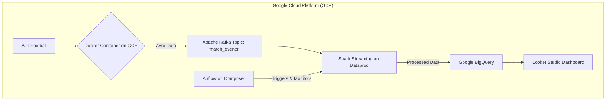

# Real-Time Football Match Data Streaming Pipeline

**Author:** Ida Bagus Gede Purwa Manik Adiputra

This project demonstrates a complete, end-to-end data engineering pipeline built on Google Cloud Platform (GCP). It captures live football match data from a third-party API, processes it in real-time, and makes it available for analysis and visualization. The entire infrastructure is managed as code using Terraform, and the data producer is containerized with Docker for portability and scalability.

## Table of Contents

- [Project Overview](#project-overview)
- [Architecture](#architecture)
- [Technology Stack](#technology-stack)
- [Project Structure](#project-structure)
- [Setup and Deployment](#setup-and-deployment)
  - [Prerequisites](#prerequisites)
  - [Step 1: Deploy Infrastructure with Terraform](#step-1-deploy-infrastructure-with-terraform)
  - [Step 2: Configure Kafka and Run Producer](#step-2-configure-kafka-and-run-producer)
  - [Step 3: Run the Spark Streaming Job](#step-3-run-the-spark-streaming-job)
  - [Step 4: Orchestrate with Airflow](#step-4-orchestrate-with-airflow)
  - [Step 5: Visualize with Looker Studio](#step-5-visualize-with-looker-studio)
- [Future Improvements](#future-improvements)
- [Author](#author)

## Project Overview

The goal of this project is to showcase a modern data engineering workflow. The pipeline performs the following actions:

1. **Ingests** live match event data (goals, cards, substitutions) from the API-Football service.
2. **Publishes** this data into a scalable Apache Kafka topic, using Avro for schema enforcement.
3. **Processes** the streaming data in real-time using a PySpark application running on a Cloud Dataproc cluster.
4. **Stores** the cleaned, structured data in Google BigQuery, a serverless data warehouse.
5. **Orchestrates** the Spark processing job using Apache Airflow (Cloud Composer) for scheduling and monitoring.
6. **Visualizes** the live match statistics on a Looker Studio dashboard.

## Architecture



### Data Flow:

1. A Python script, containerized with Docker and running on a GCE VM, polls the API-Football service for live match data.
2. New events are serialized into the Avro format and published to the `match_events` Kafka topic.
3. A long-running Spark Streaming job on a Dataproc cluster consumes messages from the Kafka topic.
4. The Spark job deserializes the Avro messages, performs minor transformations, and streams the structured data into a BigQuery table.
5. An Airflow DAG ensures the Spark job is submitted and running, providing automated scheduling and retries.
6. A Looker Studio dashboard connects to the BigQuery table to visualize the events in near real-time.

## Technology Stack

- **Cloud Provider:** Google Cloud Platform (GCP)
- **Infrastructure as Code:** Terraform
- **Containerization:** Docker
- **Messaging/Streaming:** Apache Kafka
- **Stream Processing:** Apache Spark (PySpark) on Cloud Dataproc
- **Orchestration:** Apache Airflow on Cloud Composer
- **Data Warehouse:** Google BigQuery
- **Data Visualization:** Google Looker Studio
- **Schema Definition:** Apache Avro

## Project Structure

```
.
├── infra/                  # Terraform scripts for all GCP resources
│   ├── main.tf
│   ├── variables.tf
│   └── ...
├── producer/               # Python Kafka producer application
│   ├── Dockerfile
│   ├── producer.py
│   └── schemas/
│       └── event_schema.avsc
├── spark/                  # PySpark streaming application
│   ├── match_processor.py
│   └── schemas/
│       └── event_schema.avsc
└── README.md
```

## Setup and Deployment

### Prerequisites

- A Google Cloud Platform account with billing enabled
- Google Cloud CLI installed and configured
- Terraform installed locally
- Docker Desktop installed and running locally
- An API Key from API-Football on RapidAPI

### Step 1: Deploy Infrastructure with Terraform

1. Navigate to the `infra/` directory:
   ```bash
   cd infra/
   ```

2. Initialize Terraform:
   ```bash
   terraform init
   ```

3. Apply the configuration to create all GCP resources. Enter your GCP Project ID when prompted:
   ```bash
   terraform apply
   ```

   This will create the Kafka VM, Dataproc cluster, GCS bucket, BigQuery dataset/table, and Cloud Composer environment.

### Step 2: Configure Kafka and Run Producer

1. **Build and Push the Producer Image:** On your local machine, navigate to the `producer/` directory and run:

   ```bash
   # Set your project variables
   export GCP_REGION=asia-southeast1
   export GCP_PROJECT_ID=footballfixtures

   # Build and push the Docker image
   docker build -t ${GCP_REGION}-docker.pkg.dev/${GCP_PROJECT_ID}/football-producer-repo/football-producer:final .
   docker push ${GCP_REGION}-docker.pkg.dev/${GCP_PROJECT_ID}/football-producer-repo/football-producer:final
   ```

2. **SSH into the Kafka VM:**
   ```bash
   gcloud compute ssh kafka-schema-registry-server --zone=asia-southeast1-a
   ```

3. **Create the Kafka Topic** inside the VM:
   ```bash
   /opt/confluent/bin/kafka-topics --create \
     --topic match_events \
     --bootstrap-server localhost:9092
   ```

4. **Run the Producer Container** inside the VM. Replace `<YOUR_API_KEY>` with your key:
   ```bash
   docker run -d \
     --network host \
     -e "KAFKA_BOOTSTRAP_SERVERS=localhost:9092" \
     -e "SCHEMA_REGISTRY_URL=http://localhost:8081" \
     -e "API_FOOTBALL_KEY=<YOUR_API_KEY>" \
     --name football-producer \
     --restart always \
     asia-southeast1-docker.pkg.dev/footballfixtures/football-producer-repo/football-producer:final
   ```

### Step 3: Run the Spark Streaming Job

1. **Upload Artifacts:** On your local machine, upload the Spark script and schema to your GCS bucket:
   ```bash
   gcloud storage cp spark/match_processor.py gs://footballfixtures-data-pipeline-assets/
   gcloud storage cp spark/schemas/event_schema.avsc gs://footballfixtures-data-pipeline-assets/schemas/
   ```

2. **Submit the Job:** Submit the job from your local machine (or preferably, from Google Cloud Shell):
   ```bash
   gcloud dataproc jobs submit pyspark gs://footballfixtures-data-pipeline-assets/match_processor.py \
       --cluster=spark-football-cluster \
       --region=asia-southeast1 \
       --files=gs://footballfixtures-data-pipeline-assets/schemas/event_schema.avsc \
       --properties="spark.jars.packages=org.apache.spark:spark-sql-kafka-0-10_2.12:3.3.2,org.apache.spark:spark-avro_2.12:3.3.2,com.google.cloud.spark:spark-bigquery-with-dependencies_2.12:0.34.0" \
       -- \
       35.247.177.245:9092 \
       gs://footballfixtures-data-pipeline-assets/checkpoints \
       footballfixtures.football_dataset.live_match_events
   ```

### Step 4: Orchestrate with Airflow

1. Create a Python file named `football_spark_dag.py` with the DAG definition.
2. In the GCP Console, navigate to your Cloud Composer environment.
3. Click the "DAGs Folder" link and upload the `football_spark_dag.py` file. Airflow will automatically schedule and manage your Spark job.

### Step 5: Visualize with Looker Studio

1. Go to [Looker Studio](https://lookerstudio.google.com/).
2. Create a new Data Source and connect it to your `footballfixtures.football_dataset.live_match_events` BigQuery table.
3. Create a new report and build charts (Tables, Scorecards, Bar Charts) to visualize the incoming data.
4. Set the report's data freshness to auto-refresh every 5 or 15 minutes.

## Future Improvements

- **Implement a proper Schema Registry:** Use the Confluent Schema Registry client in the producer and consumer to manage schema evolution.
- **Advanced Spark Analytics:** Enhance the Spark job to perform stateful aggregations, like calculating live scores or windowed statistics.
- **Serverless Architecture:** Replace the Kafka VM and Dataproc cluster with fully-managed services like Google Pub/Sub and Cloud Dataflow for a more cloud-native approach.
- **CI/CD Pipeline:** Use GitHub Actions or Cloud Build to automate testing, Docker image builds, and deployments.
- **Monitoring and Alerting:** Implement comprehensive monitoring using Google Cloud Monitoring and set up alerts for pipeline failures.
- **Data Quality Checks:** Add data validation and quality checks at various stages of the pipeline.
- **Cost Optimization:** Implement automatic scaling and resource optimization strategies.

## Author

**Ida Bagus Gede Purwa Manik Adiputra**

*Data Engineer | Cloud Architect*

This project demonstrates expertise in:
- Real-time data streaming architectures
- Google Cloud Platform services
- Infrastructure as Code with Terraform
- Apache Kafka and Spark streaming
- Containerization with Docker
- Data orchestration with Apache Airflow

---

*Built with ❤️ for the beautiful game of football*
